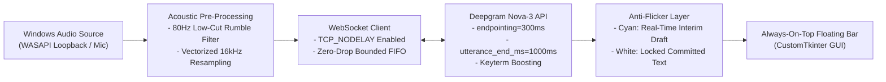

# 🧏‍♂️ OmniCaption AI

<div align="center">


<p align="center">
  <b>Ultra-low-latency, real-time live captions and floating desktop subtitles for Windows.</b><br>
  <i>Empowering deaf and hard-of-hearing individuals with instant speech-to-text across meetings, video calls, streaming, and daily conversations.</i>
</p>

[](https://www.python.org/)
[](https://deepgram.com/)
[](https://learn.microsoft.com/en-us/windows/win32/coreaudio/loopback-recording)
[](LICENSE)
[](CONTRIBUTING.md)

</div>

---

## 🌟 Our Mission: Accessible Computing for Everyone

For deaf and hard-of-hearing people, standard computer audio is a daily accessibility hurdle:
* Video meetings on **Zoom, Teams, or Google Meet** often have delayed, unreliable, or unavailable auto-captions.
* **YouTube videos, online courses, tutorials, and social media** frequently lack subtitles in specific languages or local dialects.
* Desktop voice/video calls on **WhatsApp, Discord, or Telegram** provide no native real-time captioning.

**OmniCaption AI** solves this directly at the operating system level. It captures any sound playing on your Windows PC—plus your microphone—and displays clean, instantaneous, rolling subtitles on top of your screen in **under 80 milliseconds**.

---

## ✨ Key Features

### 🖥️ Always-On-Top Floating Subtitle Bar
* **Floats over any application:** Stays visible over Zoom, Microsoft Teams, Google Meet, YouTube, VLC player, Netflix, or web browsers.
* **Zero clutter design:** Compact 130px banner specifically styled to show only active speech without vertical cutoffs or historical screen pollution.
* **Fully customizable:** Drag anywhere on the screen, toggle transparency (65% to 98%), or expand to full Studio mode with one click.

### ⚡ Ultra-Low Latency (<80ms)
* **Direct WebSocket streaming** powered by Deepgram’s state-of-the-art **Nova-3** speech model.
* **TCP Nagle algorithm bypass (`TCP_NODELAY = 1`)**: Audio chunks are pushed directly to the network interface without Windows packet-bundling delay.
* **Instant queue draining:** Prevents speech packet backlog during momentary network jitter.

### 🌍 Multilingual & Dialect Excellence
* 🇹🇳 **Tunisian Darija (`ar-tn` / الدارجة التونسية):** Specialized vocabulary prompting tuned for Tunisian idioms, daily expressions, and television culture (e.g. *Choufli Hal* characters and colloquial phrases).
* 🇫🇷 **French (`fr`):** Formatted for technical, business, and everyday French speech.
* 🇬🇧 **English (`en`):** Cloud, computing, data engineering, and conversational vocabulary.
* **Smart Numerals & Formatting:** Converts spoken numbers into digits and symbols automatically (e.g., `300`, `90%`, `$10`, `1er`).

### 🔊 Direct Hardware Audio Capture (WASAPI Loopback)
* Captures raw digital audio straight from your default speaker output device using **Windows WASAPI loopback**.
* **Zero virtual cables needed:** No complex third-party virtual audio cables (VB-Cable/Voicemeeter) required.
* **Three audio modes:**
  1. **System Audio:** Transcribes YouTube, meetings, movies, and PC sound.
  2. **Microphone:** Transcribes your room / in-person speech.
  3. **Both (Calls Mode):** Transcribes both sides of a phone/video conversation simultaneously.

### 👥 Speaker Diarization
* Detects and separates different speakers in real time.
* Assigns distinct, high-contrast colors (`[Person 1]`, `[Person 2]`) to make group conversations and conference calls intuitive to follow.

### 📜 Studio Mode & Export
* Need to take notes or review a lecture? Toggle **Keep History** to record the conversation with millisecond timestamps.
* Export full transcripts to **`.srt` (SubRip Subtitles)** or **`.txt`** with one click.
* Instant copy to clipboard.

---

## 🏗️ Architecture Overview



---

## 🚀 Quick Start Guide

### Prerequisites
* Windows 10 or Windows 11 (64-bit)
* Python 3.10, 3.11, or 3.12
* A [Deepgram API Key](https://console.deepgram.com/) *(Free tier provides $200 in free credits)*

### 1. Clone the Repository
```bash
git clone https://github.com/msouid/omnicaption-ai.git
cd omnicaption-ai
```

### 2. Install Dependencies
```bash
python -m venv venv
venv\Scripts\activate
pip install -r requirements.txt
```

### 3. Configure API Key
Create a `.env` file from the provided example:
```bash
copy .env.example .env
```
Open `.env` and add your Deepgram API Key:
```env
DEEPGRAM_API_KEY=your_deepgram_api_key_here
```

### 4. Run the Application
```bash
python app.py
```

---

## 💻 Headless / Console Mode (CMD)

Prefer running live captions directly in your Command Prompt / terminal without a GUI?
Use the built-in interactive CLI runner:

```bash
# French with PC system audio
python cli_test.py --lang fr --source system

# Tunisian Darija with PC audio
python cli_test.py --lang ar-tn --source system

# English with microphone & speaker diarization
python cli_test.py --lang en --source mic --diarize
```

Or double-click `test_in_cmd.bat` on Windows!

---

## 🎯 Custom Vocabulary Boosting

You can easily customize the words, acronyms, colleague names, or local slang that the AI prioritizes by editing [`predefined_languages_keyterms.json`](predefined_languages_keyterms.json):

```json
{
  "ar-tn": {
    "keyterms": [
      "شوفلي حل", "سبوعي", "سليمان", "برشا", "يعيشك", "يا خويا"
    ]
  },
  "fr": {
    "keyterms": [
      "Delta Lake", "Parquet", "Kubernetes", "Docker", "API REST"
    ]
  },
  "en": {
    "keyterms": [
      "PySpark", "Machine Learning", "Microservices", "CI/CD"
    ]
  }
}
```

The app automatically reads this file on startup and injects up to 90 unweighted `keyterm` prompts into Deepgram Nova-3, boosting keyword recall by up to 90%!

---

## 📦 Building a Standalone Windows Executable (.exe)

To generate a portable `.exe` that deaf family members or friends can run without needing Python installed:

```bash
pip install pyinstaller
pyinstaller --noconfirm OmniCaption_AI.spec
```
The compiled, zero-dependency standalone app will be created inside the `dist/OmniCaption_AI/` folder.

---

## 🤝 Accessibility & Community Contributions

We warmly welcome contributions from the deaf, hard-of-hearing, and accessibility engineering communities!
* Suggest UI/UX accessibility enhancements (high contrast themes, dyslexic fonts, haptic feedback).
* Expand dialect keyterm dictionaries for other Arabic varieties, French regional expressions, or specialized industry terms.
* Report bugs or submit feature requests via [GitHub Issues](https://github.com/msouid/omnicaption-ai/issues).

---

## 📄 License

This project is open-source and released under the [MIT License](LICENSE).

<div align="center">
  <sub>Built with ❤️ to make digital sound visible, inclusive, and accessible to everyone.</sub>
</div>
